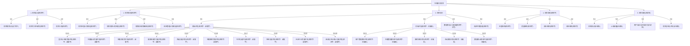

```mermaid
graph TD
    0["书海拾贝项目"] --> 1["1. 项目启动(相涵宇)"]
    1 -->|1.1| 1a["项目需求分析(付冬平)"]
    1 -->|1.2| 1b["项目可行性研究(相涵宇)"]
    1 -->|1.3| 1c["项目立项(相涵宇)"]
    0 --> 2["2. 项目规划(相涵宇)"]
    2 -->|2.1| 2a["项目进度计划制定(相涵宇)"]
    2 -->|2.2| 2b["项目资源计划制定(相涵宇)"]
    2 -->|2.3| 2c["项目成本预算编制(相涵宇)"]
    2 -->|2.4| 2d["风险管理计划制定(相涵宇)"]
    0 --> 3["3. 项目执行"]
    3 -->|3.1| 3a["前端开发(相涵宇、邱俊宇)"]
    3a -->|3.1.1| 3a1["登录与注册页面开发(相涵宇、邱俊宇)"]
    3a -->|3.1.2| 3a2["书籍展示页面开发(相涵宇、邱俊宇)"]
    3a -->|3.1.3| 3a3["书籍详情页开发(相涵宇、邱俊宇)"]
    3a -->|3.1.4| 3a4["搜索结果页功能开发(相涵宇、邱俊宇)"]
    3a -->|3.1.5| 3a5["筛选功能开发(相涵宇、邱俊宇)"]
    3a -->|3.1.6| 3a6["书籍推荐页面开发(相涵宇、邱俊宇)"]
    3a -->|3.1.7| 3a7["书评功能开发(相涵宇、邱俊宇)"]
    3a -->|3.1.8| 3a8["书单功能开发(相涵宇、邱俊宇)"]
    3a -->|3.1.9| 3a9["社区讨论页面开发(相涵宇、邱俊宇)"]
    3a -->|3.1.10| 3a10["阅读记录与统计功能开发(相涵宇、邱俊宇)"]
    3 -->|3.2| 3b["后端开发(相涵宇、何毓彤)"]
    3b -->|3.2.1| 3b1["用户管理模块开发(相涵宇、何毓彤)"]
    3b -->|3.2.2| 3b2["书籍管理模块开发(相涵宇、何毓彤)"]
    3b -->|3.2.3| 3b3["推荐系统开发(相涵宇、何毓彤)"]
    3b -->|3.2.4| 3b4["互动模块开发(相涵宇、何毓彤)"]
    3b -->|3.2.5| 3b5["数据统计模块开发(相涵宇、何毓彤)"]
    3 -->|3.3| 3c["数据库设计与搭建(相涵宇、艾尧)"]
    3 -->|3.4| 3d["测试环境搭建(相涵宇)"]
    0 --> 4["4. 项目监控(相涵宇)"]
    4 -->|4.1| 4a["进度监控(相涵宇)"]
    4 -->|4.2| 4b["质量监控(相涵宇)"]
    4 -->|4.3| 4c["成本监控(相涵宇)"]
    4 -->|4.4| 4d["风险监控(相涵宇)"]
    0 --> 5["5. 项目收尾(余欣阳)"]
    5 -->|5.1| 5a["系统测试(余欣阳)"]
    5 -->|5.2| 5b["上线部署(余欣阳)"]
    5 -->|5.3| 5c["用户培训与文档交付(余欣阳)"]
    5 -->|5.4| 5d["项目总结与评估(余欣阳)"]
```